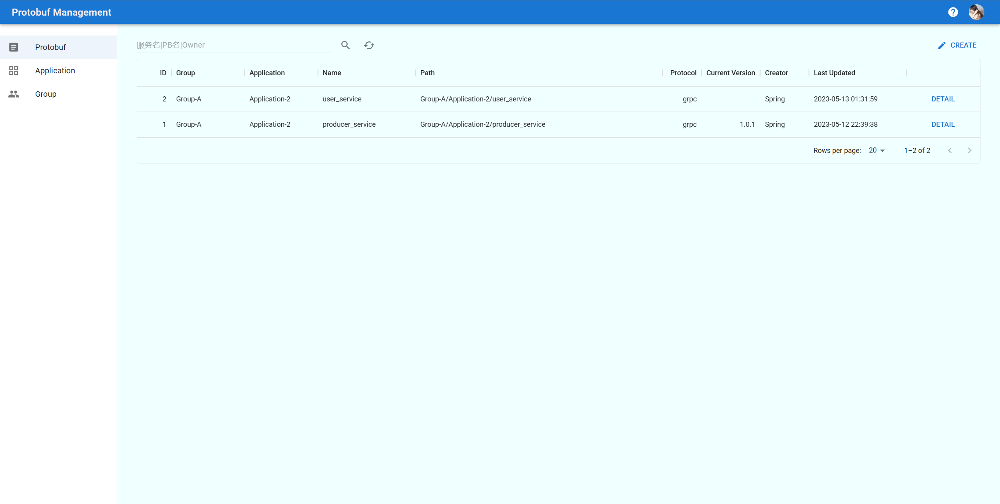

# Protobuf Manager

Google protobuf 文件统一管理平台, 旨在解决 proto 文件统一管理，查询，编辑权限统一，文件快速分享，PB文件相互依赖问题

- 支持 proto 按 Group、Application 分组创建、管理
- 关键字搜索 proto
- 支持前端管理平台
- 支持用户验证、鉴权
- 支持 protobuf 校验 [💡未来规划]
- 支持 protobuf 代码生成 [💡未来规划]

### 项目目录

- `db` - SQL 文件
- `frontend` - 前端模块，基于 React + [MUI](https://mui.com/)
- `protobuf-manager` - 后端模块 vert.x 实现
- `protobuf-manager-spring` - 后端模块 spring 实现

### 启动

1. 启动 vert.x 后端 - `mvn exec:java -f .\protobuf-manager\pom.xml`
2. 启动 spring 后端 - `mvn spring-boot:run -f .\protobuf-manager-spring\pom.xml`
3. 启动前端 - `cd frontend; npm start`

> vert.x 和 spring 旨在使用不同的框架实现同样的功能
## API & Test

可以参考 

- [test-api.rest](test-api.rest) for `protobuf-manager`
- [test-spring-api.rest](test-spring-api.rest) for `protobuf-manager-spring`